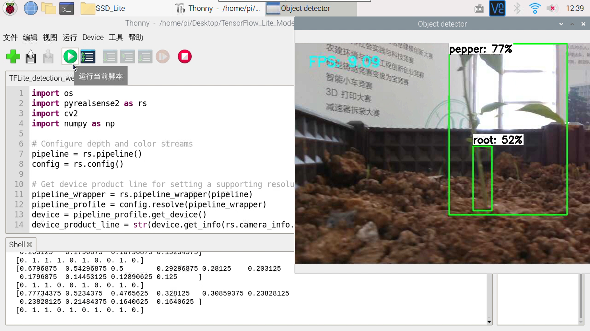

# 基于Tensorflow Lite的辣椒植株识别
同时识别辣椒植株及其感兴趣区，利用识别到的感兴趣区获取植株茎与土壤的交界点。

所用模型：SSD_0.5MobileNetv1，由TensorFlow Object Detection API训练和转化得到，相关配置见pepper_training_0.5文件夹。

转换为tflite前mAP = 88.03%。

转换为tflite后mAP = 84.12%。

利用深度相机和树莓派，实现了FPS ≈ 9.0的实时检测。

# Reference
https://github.com/EdjeElectronics/TensorFlow-Lite-Object-Detection-on-Android-and-Raspberry-Pi

https://github.com/tensorflow/models/tree/v1.13